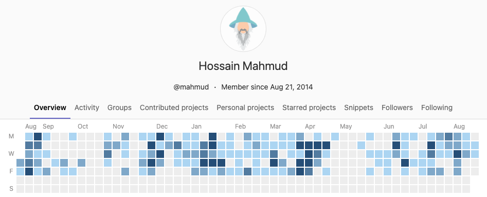

## 👋 Hello!
### Welcome to my Github!

I am a Software Engineer cum Data Scientist, currently leading the Data and Machine Learning team at Cobrainer.

  <a href="https://gitlab.com/mahmud">
     Gtilab</a>
  <a href="https://www.linkedin.com/in/hossainmahmud">
     LinkedIn</a>
  <a href="mailto:firstname dot lastname at gmail dot com">
     Email</a>

------

### 👤 Profile

Solid background of data science and machine learning. Experienced with enterprise scale agile software development, mostly data and backend services- with single command Infrastructure automation.

Contributor to pan-european open-sourced projects like Neuro-robotics platform (Python/JS), Campvis (C++/Qt). Graduated from TUM (with distinction) and BUET.

Feel free to reach out with challenging position!

------

### 📚 Stacks and 🛠️ Skills 

**Fluent** in `Python`, `C/C++/C++11`, `TypeScript`, `Git`, `SQL`, `Docker`, `Bash/Shell`, `UML`, `LATEX` \
**Data Science** with `Pandas`, `sklearn`, `scipy`, `numpy`,
`matplotlib`, `Weka`, `MOA` \
**Proficient** in `AWS Services (including CloudFormation and CDK)`, `NodeJS`, `Java`, `Prefect`, `Kafka`, `Ansible`, `CMake`, `Jira` \
**Familiar** with `C++14`, `React`, `OpenStack`, `OpenGL`, `TensorFlow`, `ROS`

**Natural languages** Bangla 🇧🇩 (native), English 🇬🇧 (native-fluent),
German 🇩🇪 (B1), Hindi 🇮🇳 & Urdu 🇵🇰 (verbal-fluent)

------

### 🧑‍💻 Experience

_Jul '21 - Present_ — **Lead Software Engineer (Data and Machine Learning)** —
[Cobrainer](https://www.cobrainer.com), Munich \
  Architecting the heart-and-soul of Cobrainer's brain. Leading the team responsible for bulding and maintaining services for text-analysis (NLP), knowledge graph, recommendation, etc. \
  `Data Science` `Machine Learning` `Recommendation` `Software Architecture` `NLP` `Knowledge Graph` `Python` `TypeScript` `Node` `AWS`

\
_Jan '20 - June '21_ — **Senior Software Engineer (Recommendation)** —
[Joyn](https://www.joyn.de), Munich \
  Joyn is the "Netflix" for the German audience. Developed and maintained recommendation engine to give every user a personalized experience.\
  `Data Science` `Machine Learning` `Recommendation` `Software Architecture` `Python` `TypeScript` `Node` `AWS`
  
\
_Jan '16 - Dec '19_ — **Research Scientist** —
[fortiss GmbH](https://www.fortiss.org/), Munich, in association as-with: \
_Aug '18 - Dec '19_ — **Senior**[1] **Software Engineer (Neuro-robotics)** — 
[Human Brain Project](https://www.humanbrainproject.eu/en/) \
  Coordinated and developed Neuro-robotics platform. [[source code]](https://bitbucket.org/hbpneurorobotics/) \
 `Machine Learning` `Brain Simulation` `Software Architecture` `Robot Simulation` `ROS` `Python` `C++` `Angular` `Super-computer (ETH)`

\
_Jan '15 - Dec '15_ — **Research Assistant (Software Development)**[2] —
[fortiss GmbH](https://www.fortiss.org/), Munich \
_Oct '14 - Mar '15_ — **Research Assistant (Data Science)**[2] —
Munich Innovation Group, Munich \
_Nov '13 - Dec '14_ — **Research Assistant (Software Development)**[2] —
[Technical University Munich](https://campar.in.tum.de/WebHome) \
  Ported libc memory and thread implementation for FreeRTOS. [[paper]](https://www.fortiss.org/en/results/scientific-publications/details/towards-trusted-apps-platforms-for-open-cps) \
  Developed data mining and visualization tool for patent data. [[source code]](https://github.com/hmsgit/minestream) \
  CAMPVis — a medical image visualization/manipulation software platform. [[source code]](https://gitlab.lrz.de/CAMP/campvis-public) \
  `Data Science` `Data Visualization` `C++` `Qt` `Python`

\
_Apr '12 - Sep '13_ — **Software Engineer** —
[Kona Software Lab](https://konai.com/?lang=en), Dhaka \
  Developed [Trusted Service Manager and Public Key Infrastructure](https://konai.com/business/cards/communication) for [Kona I](https://konai.com/?lang=en), Seoul. It paved the foundation for KonaI launching its own [Payment platform](https://konai.com/business/fintech/kona_payment).\
  `Software Architecture` `Cryptography` `Security` `PKI` `TSM` `C/C++` `Java EE`

------
### 🎓 Education

**Master of Science in Computer Science** — 
_Technical University Munich_ —
**with Distinction** \
Thesis: Ensemble learning in data streams.

**Bachelor of Science in Computer Science and Engineering** —
_Bangladesh University of Engineering and Technology_ —
with Merit \
Thesis: Group based path queries in road networks. [[paper]](https://link.springer.com/chapter/10.1007/978-3-642-40235-7_21)

------

### 🤝🏼 Contact

Best way to reach me is through <a href="mailto:firstname dot lastname at gmail dot com">
     Email</a> or <a href="https://www.linkedin.com/in/hossainmahmud">
     LinkedIn</a>

[1] As the role progressed within the team and project \
[2] Part-time position
